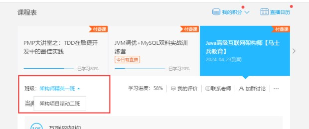
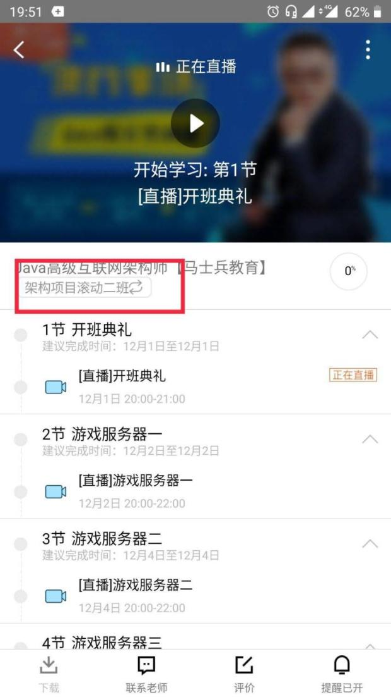

# 马士兵大学学习资料汇总

> 官网地址：https://www.mashibing.com/vip.html

## 入学流程
----
1. 班主任小姐姐会帮您进入相应报名课程的QQ群，请关注群内未来【公告】。
2. 请认真填写【VIP服务信息表】，并及时【发回班主任】，我们会尽快安排入学【一对一电话服务】。
3. 架构师二期项目课程，腾讯会在1天左右开放权限，您登录腾讯课堂网页版，点击全部订单，有个【重学/赠送】查询，点击【接受】就可以啦，请优先看一期的知识点内容。
4. **重要！重要！重要！请认真阅读这个页面内容，对您有很大的帮助。**
5. **如有问题，请先查看页面最下方的AQS是否能解决您的问题。**

## 务必牢记
----
    1. www.mashibing.com/vip.html 请牢记这个页面，信息变更会自动同步在该页面！
    2. www.github.com/bjmashibing 是我们唯一的github官方资料提供仓库

## 上课安排（特殊安排关注群公告）
----
    1.Java基础:      每周六日（15:00-17:00，20：00—22：00），每周日（15:00-17:00）
    2.架构课程:     一期：每周一三五   上课时间   晚上8：00-10：00
    3.架构课程:     二期：每周二四日   上课时间   晚上8：00—10：00
    4.大数据课程:   每周二四日   上课时间   晚上8：00-10：00
    5.AI课程:       每周六（15:00-17:00 ， 20:00-22:00）
## 开始前
----
新手预习资料 [统一访问该页面获取预习资料](http://www.mashibing.com/html/bird.html)

公开课录播视频 [统一访问该页面获取录播视频](https://pan.baidu.com/share/init?surl=K_7B7Oc6Yu6K9Qf527IBcw) 密码：f8lz

公开课录播备用地址 [备用地址](https://pan.baidu.com/share/init?surl=vBgwGxVzNqsKnxsuOyfw1A) 密码：dk2w

docker和k8s资料 网盘资料[链接](https://pan.baidu.com/share/link?shareid=3718730690&uk=3204027181) 密码：zcmq

程序员的数学 网盘资料 [链接](https://pan.baidu.com/share/init?surl=u19vQyC2YmH04k2B35alOw) [备用链接](https://pan.baidu.com/s/1u19vQyC2YmH04k2B35alOw) 提取码：fmb6

## VIP学员大课资料
----
1. JAVA后端工程师，[统一访问GitHub仓库中的java库](https://github.com/bjmashibing/java)
2. JAVA高级架构师，[统一访问GitHub仓库中的InternetArchitect库](https://github.com/bjmashibing/InternetArchitect)
3. 大数据开发工程师，[统一访问GitHub仓库中的BigDataArchitect库](https://github.com/bjmashibing/BigDataArchitect)
4. AI人工智能工程师，[统一访问GitHub仓库中的](https://www.mashibing.com/vip.html)
5. JVM资料，[统一访问GitHub仓库中的JVM库](https://github.com/bjmashibing/JVM)
6. 网约车，[统一访问GitHub](https://github.com/yueyi2019/online-taxi-file)

## 【JAVA后端、大数据、AI】无需跳跃，按顺序学习即可

# 架构一期课程每阶段对应目录章节(持续更新中)
---
## 马老师面试课
138 硬技能之上的软技巧1 [地址](https://ke.qq.com/webcourse/index.html#cid=398381&term_id=100475149&taid=4067389864285229&type=1024&vid=5285890798795090719)

143 硬技能之上的软技巧2 [地址](https://ke.qq.com/webcourse/index.html#cid=398381&term_id=100475149&taid=4067411339121709&type=1024&vid=5285890799146701546)

148 硬技能之上的软技巧3 [地址](https://ke.qq.com/webcourse/index.html#cid=398381&term_id=100475149&taid=4067432813958189&type=1024&vid=5285890799408627429)

## 马老师说的6+2的大体内容：

    1.设计模式
    2.多线程高并发
    3.网络到分布式
    4.mysql调优
    5.jvm
    6.网约车项目
    7.亿级流量项目
    8.*游戏netty项目
 

## 抽丝剥茧设计模式
[课程链接](https://ke.qq.com/course/413747?tuin=a75a5977)，[资料地址](http://www.github.com/bjmashibing/DesignPatterns)

 

## 多线程与高并发编程
[资料地址](http://www.github.com/bjmashibing/JUC)

41 多线程与高并发编程一 [地址](https://ke.qq.com/webcourse/index.html#cid=398381&term_id=100475149&taid=3385529446306861&type=1024&vid=5285890793201449862)

46 多线程与高并发编程二 [地址](https://ke.qq.com/webcourse/index.html#cid=398381&term_id=100475149&taid=3826180205974573&type=1024&vid=5285890793489922415)

52 多线程与高并发编程三 [地址](https://ke.qq.com/webcourse/index.html#cid=398381&term_id=100475149&taid=3852263542363181&type=1024&vid=5285890793810836226)

58 多线程与高并发编程四 [地址](https://ke.qq.com/webcourse/index.html#cid=398381&term_id=100475149&taid=3385576690947117&type=1024&vid=5285890794254224450)

62 多线程与高并发编程五 [地址](https://ke.qq.com/webcourse/index.html#cid=398381&term_id=100475149&taid=3385593870816301&type=1024&vid=5285890794418013695)

64 多线程与高并发编程六 [地址](https://ke.qq.com/webcourse/index.html#cid=398381&term_id=100475149&taid=3385602460750893&type=1024&vid=5285890794445687301)

69 多线程与高并发编程七 [地址](https://ke.qq.com/webcourse/index.html#cid=398381&term_id=100475149&taid=3385623935587373&type=1024&vid=5285890794816827703)

74 多线程与高并发编程八 [地址](https://ke.qq.com/webcourse/index.html#cid=398381&term_id=100475149&taid=3385645410423853&type=1024&vid=5285890794967826662)

76 多线程与高并发编程九 [地址](https://ke.qq.com/webcourse/index.html#cid=398381&term_id=100475149&taid=3385654000358445&type=1024&vid=5285890795040042548)

 

## 网络到分布式
[资料地址](https://github.com/bjmashibing/InternetArchitect/tree/master/06%20%E9%AB%98%E5%B9%B6%E5%8F%91%E8%B4%9F%E8%BD%BD%E5%9D%87%E8%A1%A1)

24 高并发负载均衡：网络协议原理 [地址](https://ke.qq.com/webcourse/index.html#cid=398381&term_id=100475149&taid=3385473611732013&type=1024&vid=5285890793326178319)

25 高并发负载均衡：LVS的DR,TUN,NAT模型推导 [地址](https://ke.qq.com/webcourse/index.html#cid=398381&term_id=100475149&taid=3385477906699309&type=1024&vid=5285890791944493841)

26 高并发负载均衡：LVS的DR模型试验搭建 [地址](https://ke.qq.com/webcourse/index.html#cid=398381&term_id=100475149&taid=3385482201666605&type=1024&vid=5285890792025153609)

28 高并发负载均衡：基于keepalived的LVS高可用搭建 [地址](https://ke.qq.com/webcourse/index.html#cid=398381&term_id=100475149&taid=3385486496633901&type=1024&vid=5285890792148439218)

[redis资料](https://github.com/bjmashibing/InternetArchitect/tree/master/09%20Redis)

43 redis 介绍及NIO原理介绍 [地址](https://ke.qq.com/webcourse/index.html#cid=398381&term_id=100475149&taid=3799285120767021&type=1024&vid=5285890793309969846)

44 redis的string类型&bitmap [地址](https://ke.qq.com/webcourse/index.html#cid=398381&term_id=100475149&taid=3385533741274157&type=1024&vid=5285890793395122444)

45 redis的list、set、hash、sorted_set、skiplist [地址](https://ke.qq.com/webcourse/index.html#cid=398381&term_id=100475149&taid=3385538036241453&type=1024&vid=5285890793480669565)

48 redis的消息订阅、pipeline、事务、modules、布隆过滤器、缓存LRU [地址](https://ke.qq.com/webcourse/index.html#cid=398381&term_id=100475149&taid=3385542331208749&type=1024&vid=5285890793608442753)

49 redis的持久化RDB、fork、copyonwrite、AOF、RDB&AOF混合使用 [地址](https://ke.qq.com/webcourse/index.html#cid=398381&term_id=100475149&taid=3385546626176045&type=1024&vid=5285890793680196340)

50 redis的集群：主从复制、CAP、PAXOS、cluster分片集群01 [地址](https://ke.qq.com/webcourse/index.html#cid=398381&term_id=100475149&taid=3385550921143341&type=1024&vid=5285890793758485066)

53 redis的集群：主从复制、CAP、PAXOS、cluster分片集群02 [地址](https://ke.qq.com/webcourse/index.html#cid=398381&term_id=100475149&taid=3385555216110637&type=1024&vid=5285890793884777413)

54 redis开发：spring.data.redis、连接、序列化、high/low api [地址](https://ke.qq.com/webcourse/index.html#cid=398381&term_id=100475149&taid=3385559511077933&type=1024&vid=5285890793923075911)

[zookeeper资料](https://github.com/bjmashibing/InternetArchitect/tree/master/10%20Zookeeper)

55 zookeeper介绍、安装、shell cli 使用，基本概念验证 [地址](https://ke.qq.com/webcourse/index.html#cid=398381&term_id=100475149&taid=3385563806045229&type=1024&vid=5285890794064663818)

56 zookeeper原理知识，paxos、zab、角色功能、API开发基础 [地址](https://ke.qq.com/webcourse/index.html#cid=398381&term_id=100475149&taid=3385568101012525&type=1024&vid=5285890794186378480)

57 zookeeper案例：分布式配置注册发现、分布式锁、ractive模式编程 [地址](https://ke.qq.com/webcourse/index.html#cid=398381&term_id=100475149&taid=3385572395979821&type=1024&vid=5285890794212987823)

 

## （二期）Spring cloud + 网约车项目
19 Spring Cloud微服务概述，注册中心搭建 [地址](https://ke.qq.com/webcourse/index.html#cid=398381&term_id=100558952&taid=4185729098191917&type=1024&vid=5285890797675722327)

20 Eureka 原理和源码 [地址](https://ke.qq.com/webcourse/index.html#cid=398381&term_id=100558952&taid=4185733393159213&type=1024&vid=5285890797908496068)

21 Eureka 配置和 服务间调用方式 [地址](https://ke.qq.com/webcourse/index.html#cid=398381&term_id=100558952&taid=4185737688126509&type=1024&vid=5285890798297399505)

22 Ribbon负载均衡 [地址](https://ke.qq.com/webcourse/index.html#cid=398381&term_id=100558952&taid=4185741983093805&type=1024&vid=5285890798557419555)

23 Feign声明式调用 [地址](https://ke.qq.com/webcourse/index.html#cid=398381&term_id=100558952&taid=4185746278061101&type=1024&vid=5285890798818937191)

24 Hystrix熔断降级 [地址](https://ke.qq.com/webcourse/index.html#cid=398381&term_id=100558952&taid=4185750573028397&type=1024&vid=5285890799168718551)

25 Hystrix熔断原理源码 [地址](https://ke.qq.com/webcourse/index.html#cid=398381&term_id=100558952&taid=4185754867995693&type=1024&vid=5285890799431751256)

26 网关Zuul的使用 [地址](https://ke.qq.com/webcourse/index.html#cid=398381&term_id=100558952&taid=4185759162962989&type=1024&vid=5285890799758210096)

（持续更新中.........）

 

## 消息中间件
[资料地址](https://github.com/bjmashibing/InternetArchitect/tree/master/16%20%E4%B8%80%E6%9C%9F%20%E6%B6%88%E6%81%AF%E4%B8%AD%E9%97%B4%E4%BB%B6)

127 消息中间件-ActiveMQ 01 [地址](https://ke.qq.com/webcourse/index.html#cid=398381&term_id=100475149&taid=4067342619644973&type=1024&vid=5285890797618744036)

129 消息中间件-ActiveMQ 02 [地址](https://ke.qq.com/webcourse/index.html#cid=398381&term_id=100475149&taid=4067351209579565&type=1024&vid=5285890797648000488)

130 消息中间件-ActiveMQ 03 [地址](https://ke.qq.com/webcourse/index.html#cid=398381&term_id=100475149&taid=4067355504546861&type=1024&vid=5285890797801304966)

131 消息中间件-ActiveMQ 04 [地址](https://ke.qq.com/webcourse/index.html#cid=398381&term_id=100475149&taid=4067359799514157&type=1024&vid=5285890797855910122)

133 消息中间件-ActiveMQ 05 [地址](https://ke.qq.com/webcourse/index.html#cid=398381&term_id=100475149&taid=4067368389448749&type=1024&vid=5285890798408980736)

134 消息中间件-ActiveMQ 06 [地址](https://ke.qq.com/webcourse/index.html#cid=398381&term_id=100475149&taid=4067372684416045&type=1024&vid=5285890798483964676)

135 消息中间件-ActiveMQ 07 [地址](https://ke.qq.com/webcourse/index.html#cid=398381&term_id=100475149&taid=4067376979383341&type=1024&vid=5285890798593302228)

136 消息中间件-ActiveMQ 08 [地址](https://ke.qq.com/webcourse/index.html#cid=398381&term_id=100475149&taid=4067381274350637&type=1024&vid=5285890798667036503)

139 消息中间件-RocketMQ 01 [地址](https://ke.qq.com/webcourse/index.html#cid=398381&term_id=100475149&taid=4067394159252525&type=1024&vid=5285890798908368452)

140 消息中间件-RocketMQ 02 [地址](https://ke.qq.com/webcourse/index.html#cid=398381&term_id=100475149&taid=4067398454219821&type=1024&vid=5285890798979430668)

141 消息中间件-RocketMQ 03 [地址](https://ke.qq.com/webcourse/index.html#cid=398381&term_id=100475149&taid=4067402749187117&type=1024&vid=5285890799092482131)

144 消息中间件-RocketMQ 04 [地址](https://ke.qq.com/webcourse/index.html#cid=398381&term_id=100475149&taid=4067415634089005&type=1024&vid=5285890799206705257)

145 消息中间件-RocketMQ 05 [地址](https://ke.qq.com/webcourse/index.html#cid=398381&term_id=100475149&taid=4067419929056301&type=1024&vid=5285890799282850548)

146 消息中间件-RocketMQ 06 [地址](https://ke.qq.com/webcourse/index.html#cid=398381&term_id=100475149&taid=4067424224023597&type=1024&vid=5285890799362360301)

（持续更新中.........）

 

## JVM
[资料地址](https://github.com/bjmashibing/JVM)

80 JVM入门级class文件格式 [地址](https://ke.qq.com/webcourse/index.html#cid=398381&term_id=100475149&taid=3385671180227629&type=1024&vid=5285890795254417183)

86 详解Class加载过程 [地址](https://ke.qq.com/webcourse/index.html#cid=398381&term_id=100475149&taid=3385696950031405&type=1024&vid=5285890795495098927)

93 Java内存模型 [地址](https://ke.qq.com/webcourse/index.html#cid=398381&term_id=100475149&taid=4067196590756909&type=1024&vid=5285890795710259061)

97 内存屏障与JVM指令 [地址](https://ke.qq.com/webcourse/index.html#cid=398381&term_id=100475149&taid=4067213770626093&type=1024&vid=5285890795920195540)

102 Java运行时数据区和常用指令 [地址](https://ke.qq.com/webcourse/index.html#cid=398381&term_id=100475149&taid=4067235245462573&type=1024&vid=5285890796130155429)

110 JVM调优必备理论知识-GC Collector-三色标记 [地址](https://ke.qq.com/webcourse/index.html#cid=398381&term_id=100475149&taid=4067269605200941&type=1024&vid=5285890796558161975)

114 JVM调优实战 [地址](https://ke.qq.com/webcourse/index.html#cid=398381&term_id=100475149&taid=4067286785070125&type=1024&vid=5285890796770442292)

119 JVM实战调优 [地址](https://ke.qq.com/webcourse/index.html#cid=398381&term_id=100475149&taid=4067308259906605&type=1024&vid=5285890797005699401)

124 JVM实战调优 [地址](https://ke.qq.com/webcourse/index.html#cid=398381&term_id=100475149&taid=4067329734743085&type=1024&vid=5285890797384112958)

128 垃圾回收算法串讲 [地址](https://ke.qq.com/webcourse/index.html#cid=398381&term_id=100475149&taid=4067346914612269&type=1024&vid=5285890797630925075)

132 JVM常见参数总结 [地址](https://ke.qq.com/webcourse/index.html#cid=398381&term_id=100475149&taid=4067364094481453&type=1024&vid=5285890797958593897)

 

## 底层：操作系统 组成原理
150 java程序员需要了解的底层知识第一课 [地址](https://ke.qq.com/webcourse/index.html#cid=398381&term_id=100475149&taid=4067441403892781&type=1024&vid=5285890799733685067)

 

## MYSQL基础
mysql视频：[链接](https://pan.baidu.com/share/init?surl=M5ztqdYJAoHaU__Z2oX_hA) 提取码：iw0k

mysql有道云笔记的连接：文档：MySQL [链接](http://note.youdao.com/noteshare?id=764336de06a157bbdffe5fb89ad7b733)

 

## mysql调优
[资料地址](https://github.com/bjmashibing/InternetArchitect/tree/master/13mysql%E8%B0%83%E4%BC%98)

107 精通mysql调优大师班一 [地址](https://ke.qq.com/webcourse/index.html#cid=398381&term_id=100475149&taid=4067256720299053&type=1024&vid=5285890796450429140)

108 精通mysql调优大师班二 [地址](https://ke.qq.com/webcourse/index.html#cid=398381&term_id=100475149&taid=4067261015266349&type=1024&vid=5285890796510158724)

111 精通mysql调优大师班三 [地址](https://ke.qq.com/webcourse/index.html#cid=398381&term_id=100475149&taid=4067273900168237&type=1024&vid=5285890796598967563)

112 精通mysql调优大师班四 [地址](https://ke.qq.com/webcourse/index.html#cid=398381&term_id=100475149&taid=4067278195135533&type=1024&vid=5285890796686398461)

113 精通mysql调优大师班五 [地址](https://ke.qq.com/webcourse/index.html#cid=398381&term_id=100475149&taid=4067282490102829&type=1024&vid=5285890796759143626)

115 精通mysql调优大师班六 [地址](https://ke.qq.com/webcourse/index.html#cid=398381&term_id=100475149&taid=4067291080037421&type=1024&vid=5285890796847119428)

116 精通mysql调优大师班七 [地址](https://ke.qq.com/webcourse/index.html#cid=398381&term_id=100475149&taid=4067295375004717&type=1024&vid=5285890796905611672)

117 精通mysql调优大师班八 [地址](https://ke.qq.com/webcourse/index.html#cid=398381&term_id=100475149&taid=4067299669972013&type=1024&vid=5285890796964066182)

 

## Spring源码分析
18 Spring源码-源码概览 [地址](https://ke.qq.com/webcourse/index.html#cid=398381&term_id=100475149&taid=3665578493875245&type=1024&vid=5285890793322671596)

23 源码分析-Spring容器初始化过程 [地址](https://ke.qq.com/webcourse/index.html#cid=398381&term_id=100475149&taid=3691837923922989&type=1024&vid=5285890793327641777)

27 源码分析-Spring Environment原理 [地址](https://ke.qq.com/webcourse/index.html#cid=398381&term_id=100475149&taid=3712840314000429&type=1024&vid=5285890792035360585)

29 源码分析-spring监听器 [地址](https://ke.qq.com/webcourse/index.html#cid=398381&term_id=100475149&taid=3385490791601197&type=1024&vid=5285890792322244342)

34 源码分析-Spring IOC [地址](https://ke.qq.com/webcourse/index.html#cid=398381&term_id=100475149&taid=3747006778840109&type=1024&vid=5285890792641040588)

37 源码分析-Spring AOP原理 [地址](https://ke.qq.com/webcourse/index.html#cid=398381&term_id=100475149&taid=3385516561404973&type=1024&vid=5285890792923489265)

42 源码分析-Spring Boot Starter原理 [地址](https://ke.qq.com/webcourse/index.html#cid=398381&term_id=100475149&taid=3799280825799725&type=1024&vid=5285890793241229133)

47 Spring高级运用 [地址](https://ke.qq.com/webcourse/index.html#cid=398381&term_id=100475149&taid=3826218860680237&type=1024&vid=5285890793526236477)

51 Spring工作常用技巧 [地址](https://ke.qq.com/webcourse/index.html#cid=398381&term_id=100475149&taid=3852259247395885&type=1024&vid=5285890793772422622)

71 Spring源码总结 [地址](https://ke.qq.com/webcourse/index.html#cid=398381&term_id=100475149&taid=3385632525521965&type=1024&vid=5285890794858754043)

 

## NIO & Netty
81 Java NIO 一 [地址](https://ke.qq.com/webcourse/index.html#cid=398381&term_id=100475149&taid=3385675475194925&type=1024&vid=5285890795284954411)

84 Java NIO 二 [地址](https://ke.qq.com/webcourse/index.html#cid=398381&term_id=100475149&taid=3385688360096813&type=1024&vid=5285890795463737756)

91 NIO之ByteBuffer [地址](https://ke.qq.com/webcourse/index.html#cid=398381&term_id=100475149&taid=4067188000822317&type=1024&vid=5285890795677757727)

96 Netty 之NIO selector [地址](https://ke.qq.com/webcourse/index.html#cid=398381&term_id=100475149&taid=4067209475658797&type=1024&vid=5285890795889357665)

101 Netty之内存管理 [地址](https://ke.qq.com/webcourse/index.html#cid=398381&term_id=100475149&taid=4067230950495277&type=1024&vid=5285890796098401636)

109 Netty之内存管理二 [地址](https://ke.qq.com/webcourse/index.html#cid=398381&term_id=100475149&taid=4067265310233645&type=1024&vid=5285890796550106193)

118 NETTY小结 [地址](https://ke.qq.com/webcourse/index.html#cid=398381&term_id=100475149&taid=4067303964939309&type=1024&vid=5285890796973596740)

137 Netty 内存管理 （netty源码） [地址](https://ke.qq.com/webcourse/index.html#cid=398381&term_id=100475149&taid=4067385569317933&type=1024&vid=5285890798755934697)

142 Netty 内存管理 [地址](https://ke.qq.com/webcourse/index.html#cid=398381&term_id=100475149&taid=4067407044154413&type=1024&vid=5285890799103302208)

147 Netty 内存管理 [地址](https://ke.qq.com/webcourse/index.html#cid=398381&term_id=100475149&taid=4067428518990893&type=1024&vid=5285890799370162674)

149 Netty 启动原理 [地址](https://ke.qq.com/webcourse/index.html#cid=398381&term_id=100475149&taid=4067437108925485&type=1024&vid=5285890799692577235)

 

## 亿级流量多级缓存高并发系统架构实战
59 亿级流量多级缓存高并发系统架构实战一 [地址](https://ke.qq.com/webcourse/index.html#cid=398381&term_id=100475149&taid=3385580985914413&type=1024&vid=5285890794297568090)

60 亿级流量多级缓存高并发系统架构实战二 [地址](https://ke.qq.com/webcourse/index.html#cid=398381&term_id=100475149&taid=3385585280881709&type=1024&vid=5285890794352666497)

61 亿级流量多级缓存高并发系统架构实战三 [地址](https://ke.qq.com/webcourse/index.html#cid=398381&term_id=100475149&taid=3385589575849005&type=1024&vid=5285890794406875432)

65 亿级流量多级缓存高并发系统架构实战四 [地址](https://ke.qq.com/webcourse/index.html#cid=398381&term_id=100475149&taid=3385606755718189&type=1024&vid=5285890794487964582)

68 亿级流量多级缓存高并发系统架构实战五 [地址](https://ke.qq.com/webcourse/index.html#cid=398381&term_id=100475149&taid=3385619640620077&type=1024&vid=5285890794755056474)

70 亿级流量多级缓存高并发系统架构实战六 [地址](https://ke.qq.com/webcourse/index.html#cid=398381&term_id=100475149&taid=3385628230554669&type=1024&vid=5285890794846482328)

73 亿级流量多级缓存高并发系统架构实战七 [地址](https://ke.qq.com/webcourse/index.html#cid=398381&term_id=100475149&taid=3385641115456557&type=1024&vid=5285890794907098090)

75 亿级流量系统架构之限流 [地址](https://ke.qq.com/webcourse/index.html#cid=398381&term_id=100475149&taid=3385649705391149&type=1024&vid=5285890795027196090)

78 亿级流量系统架构之扩容 [地址](https://ke.qq.com/webcourse/index.html#cid=398381&term_id=100475149&taid=3385662590293037&type=1024&vid=5285890795118954092)

79 亿级流量系统架构之降级 [地址](https://ke.qq.com/webcourse/index.html#cid=398381&term_id=100475149&taid=3385666885260333&type=1024&vid=5285890795241583575)

82 亿级流量系统架构之分布式事务原理 [地址](https://ke.qq.com/webcourse/index.html#cid=398381&term_id=100475149&taid=3385679770162221&type=1024&vid=5285890795334000268)

83 亿级流量系统架构之实战流量分发层 [地址](https://ke.qq.com/webcourse/index.html#cid=398381&term_id=100475149&taid=3385684065129517&type=1024&vid=5285890795452423442)

87 亿级流量系统架构之实战域名与https [地址](https://ke.qq.com/webcourse/index.html#cid=398381&term_id=100475149&taid=4067170820953133&type=1024&vid=5285890795502214371)

88 亿级流量系统架构之网关kong [地址](https://ke.qq.com/webcourse/index.html#cid=398381&term_id=100475149&taid=4067175115920429&type=1024&vid=5285890795543304509)

89 电商系统详情页PLAN A [地址](https://ke.qq.com/webcourse/index.html#cid=398381&term_id=100475149&taid=4067179410887725&type=1024&vid=5285890795603819984)

90 静态文件生成-rsync [地址](https://ke.qq.com/webcourse/index.html#cid=398381&term_id=100475149&taid=4067183705855021&type=1024&vid=5285890795665408978)

94 静态化文件生成业务流程及技术选型解析 [地址](https://ke.qq.com/webcourse/index.html#cid=398381&term_id=100475149&taid=4067200885724205&type=1024&vid=5285890795819050143)

95 Arica开发实战CRUD [地址](https://ke.qq.com/webcourse/index.html#cid=398381&term_id=100475149&taid=4067205180691501&type=1024&vid=5285890795877662149)

98 静态文件生成 [地址](https://ke.qq.com/webcourse/index.html#cid=398381&term_id=100475149&taid=4067218065593389&type=1024&vid=5285890795968574352)

99 html同步，生成首页，批量生成，健康检查 [地址](https://ke.qq.com/webcourse/index.html#cid=398381&term_id=100475149&taid=4067222360560685&type=1024&vid=5285890796027373496)

100 单机事务，并发锁，压力测试 [地址](https://ke.qq.com/webcourse/index.html#cid=398381&term_id=100475149&taid=4067226655527981&type=1024&vid=5285890796087063574)

103 html架构的应用场景，扩容，静态分页实现 [地址](https://ke.qq.com/webcourse/index.html#cid=398381&term_id=100475149&taid=4067239540429869&type=1024&vid=5285890796178868473)

104 分页逻辑2，动态加静态，lua访问mysql [地址](https://ke.qq.com/webcourse/index.html#cid=398381&term_id=100475149&taid=4067243835397165&type=1024&vid=5285890796239514922)

105 resty_template,静态文件补偿机制实现 [地址](https://ke.qq.com/webcourse/index.html#cid=398381&term_id=100475149&taid=4067248130364461&type=1024&vid=5285890796299478231)

106 亿级流量高并发项目总结 [地址](https://ke.qq.com/webcourse/index.html#cid=398381&term_id=100475149&taid=4067252425331757&type=1024&vid=5285890796391731488)

 

## 区块链
120 区块链-比特币、挖矿、炒币原理(1) [地址](https://ke.qq.com/webcourse/index.html#cid=398381&term_id=100475149&taid=4067312554873901&type=1024&vid=5285890797052447190)

121 区块链-比特币、挖矿、炒币原理(2) [地址](https://ke.qq.com/webcourse/index.html#cid=398381&term_id=100475149&taid=4067316849841197&type=1024&vid=5285890797111429226)

122 区块链-以太坊原理 [地址](https://ke.qq.com/webcourse/index.html#cid=398381&term_id=100475149&taid=4067321144808493&type=1024&vid=5285890797169219172)

123 区块链-幽灵协议，pow，pos [地址](https://ke.qq.com/webcourse/index.html#cid=398381&term_id=100475149&taid=4067325439775789&type=1024&vid=5285890797257969276)

125 区块链-DPOS共识协议，solidity智能合约开发 [地址](https://ke.qq.com/webcourse/index.html#cid=398381&term_id=100475149&taid=4067334029710381&type=1024&vid=5285890797401704704)

126 区块链-solidity手写加密货币 [地址](https://ke.qq.com/webcourse/index.html#cid=398381&term_id=100475149&taid=4067338324677677&type=1024&vid=5285890797502304978)

 

## 架构师前置知识
4 spring,ioc入门与详解 [地址](https://ke.qq.com/webcourse/index.html#cid=398381&term_id=100475149&taid=3385404892255277&type=1024&vid=5285890790625135834)

5 maven的简单构建，springaop [地址](https://ke.qq.com/webcourse/index.html#cid=398381&term_id=100475149&taid=3385409187222573&type=1024&vid=5285890790630114912)

6 spring中的循环依赖、代理方式讲解 [地址](https://ke.qq.com/webcourse/index.html#cid=398381&term_id=100475149&taid=3385413482189869&type=1024&vid=5285890790589942447)

7 springboot mvc项目结构、开发、热部署 [地址](https://ke.qq.com/webcourse/index.html#cid=398381&term_id=100475149&taid=3385417777157165&type=1024&vid=5285890790511540996)

8 springboot web项目整合数据源、Thymeleaf [地址](https://ke.qq.com/webcourse/index.html#cid=398381&term_id=100475149&taid=3385422072124461&type=1024&vid=5285890793325592794)

9 项目开发-thymeleaf、jpa、bootstrap [地址](https://ke.qq.com/webcourse/index.html#cid=398381&term_id=100475149&taid=3385426367091757&type=1024&vid=5285890793329539892)

10 mybatis整合SpringBoot、mybatis-generator [地址](https://ke.qq.com/webcourse/index.html#cid=398381&term_id=100475149&taid=3385430662059053&type=1024&vid=5285890793325623033)

11 企业项目开发中的角色、流程、任务分配 [地址](https://ke.qq.com/webcourse/index.html#cid=398381&term_id=100475149&taid=3385434957026349&type=1024&vid=5285890793326572044)

12 pageHelper、翻页、Example使用、异步表单 [地址](https://ke.qq.com/webcourse/index.html#cid=398381&term_id=100475149&taid=3385439251993645&type=1024&vid=5285890793322637365)

13 开发-RBAC、表设计、YAML、项目配置 [地址](https://ke.qq.com/webcourse/index.html#cid=398381&term_id=100475149&taid=3385443546960941&type=1024&vid=5285890793322532723)

14 开发-RBAC前后端、mybatis多表、thymeleaf [地址](https://ke.qq.com/webcourse/index.html#cid=398381&term_id=100475149&taid=3385447841928237&type=1024&vid=5285890793322418005)

15 开发-Odata、Restful、SpringBoot文件上传 [地址](https://ke.qq.com/webcourse/index.html#cid=398381&term_id=100475149&taid=3385452136895533&type=1024&vid=5285890793326639752)

16 开发-权限认证、Icheck、Mybatis plus [地址](https://ke.qq.com/webcourse/index.html#cid=398381&term_id=100475149&taid=3385456431862829&type=1024&vid=5285890793326245685)

17 Tengine原理、对比、部署、配置、虚拟主机 [地址](https://ke.qq.com/webcourse/index.html#cid=398381&term_id=100475149&taid=3528762310661165&type=1024&vid=5285890793323424174)

19 Tengine 反向代理、负载均衡、 session共享 等 [地址](https://ke.qq.com/webcourse/index.html#cid=398381&term_id=100475149&taid=3528766605628461&type=1024&vid=5285890793328967920)

20 Tengine 动静分离 https SSL 非对称加密 [地址](https://ke.qq.com/webcourse/index.html#cid=398381&term_id=100475149&taid=3385460726830125&type=1024&vid=5285890791583725588)

21 Nginx OpenSSL 自签名证书 xca FastDFS介绍 [地址](https://ke.qq.com/webcourse/index.html#cid=398381&term_id=100475149&taid=3385465021797421&type=1024&vid=5285890793323154714)

22 FastDFS 部署 原理 整合Nginx JavaAPI [地址](https://ke.qq.com/webcourse/index.html#cid=398381&term_id=100475149&taid=3385469316764717&type=1024&vid=5285890793323413627)

30 FastDFS 集群原理 部署 缓存 [地址](https://ke.qq.com/webcourse/index.html#cid=398381&term_id=100475149&taid=3737287267849261&type=1024&vid=5285890792435208507)

31 FastDFS keepalived 高可用 zookeeper [地址](https://ke.qq.com/webcourse/index.html#cid=398381&term_id=100475149&taid=3385495086568493&type=1024&vid=5285890792474198556)

32 dubbo demo、角色、 RPC、原理 、RMI [地址](https://ke.qq.com/webcourse/index.html#cid=398381&term_id=100475149&taid=3385499381535789&type=1024&vid=5285890792514876863)

33 项目微服务拆分 注册中心、dubbo admin [地址](https://ke.qq.com/webcourse/index.html#cid=398381&term_id=100475149&taid=3385503676503085&type=1024&vid=5285890792633119995)

35 dubbo下的微信公众号项目 一 [地址](https://ke.qq.com/webcourse/index.html#cid=398381&term_id=100475149&taid=3385507971470381&type=1024&vid=5285890792754277214)

36 dubbo下的微信公众号项目 二 [地址](https://ke.qq.com/webcourse/index.html#cid=398381&term_id=100475149&taid=3385512266437677&type=1024&vid=5285890792834815388)

38 RestFul风格API、swagger API [地址](https://ke.qq.com/webcourse/index.html#cid=398381&term_id=100475149&taid=3385512266437677&type=1024&vid=5285890792834815388)

39 dubbo核心配置 聚合项目构建 [地址](https://ke.qq.com/webcourse/index.html#cid=398381&term_id=100475149&taid=3385520856372269&type=1024&vid=5285890793032809072)

 

 

 

## PMP大讲堂之：TDD在敏捷开发中的最佳实践
[视频地址](https://pan.baidu.com/share/init?surl=ZAifDHBKYpnEsLoQ794SRg) 密码：y5fe

# 架构二期课程每阶段对应目录章节(持续更新中)

## Java游戏开发
2 创建 Netty 服务器 [地址](https://ke.qq.com/webcourse/index.html#cid=398381&term_id=100558952&taid=4185656083747885&type=1024&vid=5285890796421259974)

3 Protobuf 消息应用 [地址](https://ke.qq.com/webcourse/index.html#cid=398381&term_id=100558952&taid=4185660378715181&type=1024&vid=5285890796480593357)

4 重构，设计模式实战 [地址](https://ke.qq.com/webcourse/index.html#cid=398381&term_id=100558952&taid=4185664673682477&type=1024&vid=5285890796569015277)

5 通过 Javassist 提升反射效率 [地址](https://ke.qq.com/webcourse/index.html#cid=398381&term_id=100558952&taid=4185668968649773&type=1024&vid=5285890796628391162)

6 重新设计移动消息 [地址](https://ke.qq.com/webcourse/index.html#cid=398381&term_id=100558952&taid=4185673263617069&type=1024&vid=5285890796730368428)

7 游戏服务器中的单线程设计 [地址](https://ke.qq.com/webcourse/index.html#cid=398381&term_id=100558952&taid=4185677558584365&type=1024&vid=5285890796819334080)

8 多线程读写数据库 [地址](https://ke.qq.com/webcourse/index.html#cid=398381&term_id=100558952&taid=4185681853551661&type=1024&vid=5285890796877116049)

9 利用RocketMQ 实现简单的排行榜 [地址](https://ke.qq.com/webcourse/index.html#cid=398381&term_id=100558952&taid=4185686148518957&type=1024&vid=5285890796936155669)

10 游戏服务器的部署 [地址](https://ke.qq.com/webcourse/index.html#cid=398381&term_id=100558952&taid=4185690443486253&type=1024&vid=5285890797024197969)

 

## springboot
11 架构体系讲解及springboot入门 [地址](https://ke.qq.com/webcourse/index.html#cid=398381&term_id=100558952&taid=4185694738453549&type=1024&vid=5285890797081447599)

12 springboot web开发 [地址](https://ke.qq.com/webcourse/index.html#cid=398381&term_id=100558952&taid=4185699033420845&type=1024&vid=5285890797218126105)

13 springboot-thymeleaf及数据源配置 [地址](https://ke.qq.com/webcourse/index.html#cid=398381&term_id=100558952&taid=4185703328388141&type=1024&vid=5285890797229364178)

14 springboot启动源码解析一 [地址](https://ke.qq.com/webcourse/index.html#cid=398381&term_id=100558952&taid=4185707623355437&type=1024&vid=5285890797343966192)

15 springboot启动源码解析二 [地址](https://ke.qq.com/webcourse/index.html#cid=398381&term_id=100558952&taid=4185711918322733&type=1024&vid=5285890797420877897)

16 springboot启动源码解析三 [地址](https://ke.qq.com/webcourse/index.html#cid=398381&term_id=100558952&taid=4185716213290029&type=1024&vid=5285890797431520693)

17 springboot自动装配源码解析 [地址](https://ke.qq.com/webcourse/index.html#cid=398381&term_id=100558952&taid=4185720508257325&type=1024&vid=5285890797531324996)

18 springboot与tomcat整合源码解析 [地址](https://ke.qq.com/webcourse/index.html#cid=398381&term_id=100558952&taid=4185724803224621&type=1024&vid=5285890797589178594)

 

## 网约车项目
19 网约车项目一 [地址](https://ke.qq.com/webcourse/index.html#cid=398381&term_id=100558952&taid=4185729098191917&type=1024&vid=5285890797675722327)

20 网约车项目二 [地址](https://ke.qq.com/webcourse/index.html#cid=398381&term_id=100558952&taid=4185733393159213&type=1024&vid=5285890797908496068)

21 网约车项目三 [地址](https://ke.qq.com/webcourse/index.html#cid=398381&term_id=100558952&taid=4185737688126509&type=1024&vid=5285890798297399505)

22 网约车项目四 [地址](https://ke.qq.com/webcourse/index.html#cid=398381&term_id=100558952&taid=4185741983093805&type=1024&vid=5285890798557419555)

23 网约车项目五 [地址](https://ke.qq.com/webcourse/index.html#cid=398381&term_id=100558952&taid=4185746278061101&type=1024&vid=5285890798818937191)

24 网约车项目六 [地址](https://ke.qq.com/webcourse/index.html#cid=398381&term_id=100558952&taid=4185750573028397&type=1024&vid=5285890799168718551)

 

# 课程包中的小课
1. 多线程与高并发，[课程链接](https://ke.qq.com/course/446547?tuin=a75a5977)，[资料地址](http://www.github.com/bjmashibing/JUC)
2. 数据结构与算法，[课程链接](https://ke.qq.com/course/429723?tuin=a75a5977)，[资料地址](http://www.github.com/bjmashibing/Algorithm)
3. 抽丝剥茧设计模式，[课程链接](https://ke.qq.com/course/413747?tuin=a75a5977)，[资料地址](http://www.github.com/bjmashibing/DesignPatterns)
4. 坦克大战一期，[课程链接](https://ke.qq.com/course/398245?tuin=a75a5977)，[资料地址](http://www.github.com/bjmashibing/tank)
5. 坦克大战二期，[课程链接](https://ke.qq.com/course/398245?tuin=a75a5977#term_id=100494276)，[资料地址](http://www.github.com/bjmashibing/Tank2019V2)
6. Java web【马士兵教育】，[课程链接](https://ke.qq.com/course/422068?tuin=a75a5977)，[资料地址](https://github.com/bjmashibing/javaweb)
7. Java日志框架-SLF4J入门，[课程链接](https://ke.qq.com/course/452165?taid=3999606690473541&tuin=a75a5977)
8. 超级小白编程入门，[课程链接](https://ke.qq.com/course/444431?taid=3881267456559119&tuin=a75a5977)
9. 简明JDBC教程，[课程链接](https://ke.qq.com/course/430884?taid=3699732073845540&tuin=a75a5977)
10. Java响应式编程【马士兵教育】，[课程链接](https://ke.qq.com/course/429389?taid=3506376941145421&tuin=a75a5977)
11. 马士兵Java零基础入门【马士兵教育】，[课程链接](https://ke.qq.com/course/421576?taid=3640328381165256&tuin=a75a5977)
12. 架构师必备技能doker入门到专精，[课程链接](https://ke.qq.com/course/458623?tuin=a75a5977)，[资料地址](https://www.mashibing.com/vip.html)
13. 架构师高级技能kubernetes入门到精通，[课程链接](https://www.mashibing.com/vip.html)，[资料地址](https://www.mashibing.com/vip.html)
 

# AQS:
## 一、腾讯课堂目录为什么没有按阶段划分，看起来比较乱？
答：因为咱们在讲知识点的过程中，有的阶段老师会根据大家的吸收程度，做一些延长，但是腾讯课堂的目录没办法按阶段这么划分增加。所以咱们会是一节一节的来，中间会穿插有补课，老师担心大家看目录会觉得乱，找不到课，就给大家整理了一个vip页面，按阶段划分开来了。你按照VIP界面的课程目录章节地址看课就可以呢。

 

## 二、腾讯课堂的目录标题和内容不对应
答：腾讯课堂前期的目录，因为会有一些知识点增加，会再添加一节到大标题下面，但是这个无法再更改啦，您以小标题内容为准哦，后面咱们的课程目录和标题就对应上啦，而且咱们的vip页面和腾讯课堂的目录一周会更改一次，您可以按照VIP页面的目录章节看课哒

 

## 三、架构一期和二期的区别？
答：架构一期讲的知识点，二期讲项目。我们本着讲最全的知识，所以一期从5个月扩充到近1年的知识量，同时开设了并行的二期班，主要讲项目。

 

## 四、一对一什么时间给我约呢？
答：在您提交【VIP服务信息表】给班主任之后，因为报名学员很多，班主任老师会在三天内为您预约讲师，给您进行电话一对一的学习计划。

 

## 五、为什么登录课堂看课只能看到架构一期的课程，看不到架构二期的？
PC客户端：

手机客户端：
 
 

 

## 以下课程是在VIP大课截取，VIP学员不必观看
1. 自定义注解，[课程链接](https://ke.qq.com/course/458641?tuin=6e67ea5e)
2. JDK8新特性-stream api，[课程链接](https://ke.qq.com/course/458646?tuin=6e67ea5e)
3. JDK8新特性～lambda表达式，[课程链接](https://ke.qq.com/course/458630?tuin=6e67ea5e)
4. 高并发高可用lvs+keepalived分布式架构师前修课，[课程链接](https://ke.qq.com/course/458615?tuin=a75a5977)
5. 全网最新redis+zookeeper架构师必修课，[课程链接](https://ke.qq.com/course/458724?tuin=6e67ea5e)
6. Hadoop零基础从入门到精通，[课程链接](https://ke.qq.com/course/432890?tuin=a75a5977)
7. Java web【马士兵教育】，[课程链接](https://ke.qq.com/course/422068?tuin=a75a5977)

